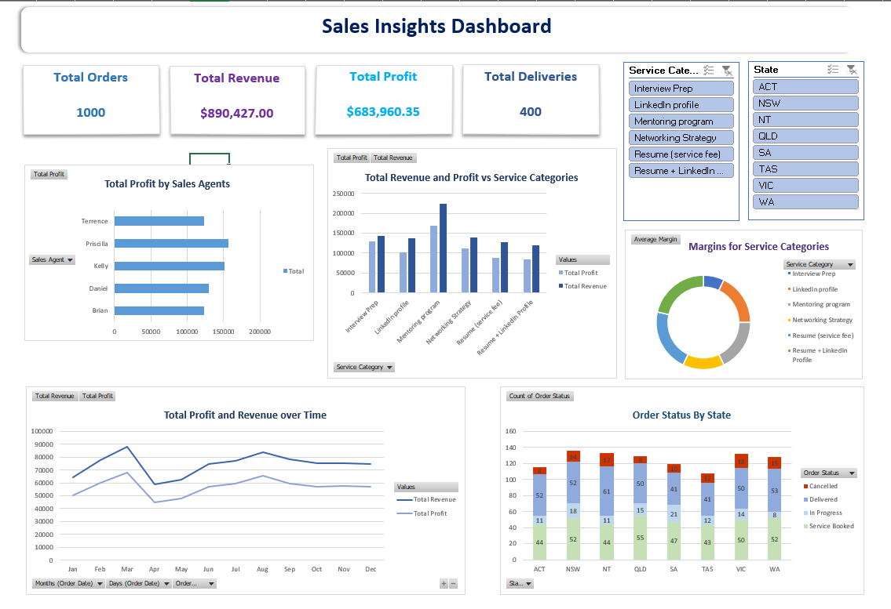

# Sales Insights Dashboard (Excel)

An interactive Excel dashboard analysing 1,000 orders from 2024 for an Australian career-services business that sells resume writing, LinkedIn profile, interview preparation, networking and mentoring services to graduates.

**Tools:** Microsoft Excel (Excel Tables, XLOOKUP, VLOOKUP, TEXT, PivotTables, PivotCharts, Slicers)

## Business Questions

- How much revenue and profit did the business generate in 2024?
- Which sales agents and service categories contribute most to profit?
- How does performance change month to month?
- How do order outcomes (delivered, booked, in progress, cancelled) differ across states?

## Dataset

| Sheet | Description |
|---|---|
| `Sales` | 1,000 orders: service, order date, quantity, status, state, sale price, sales agent |
| `Customers` | Customer details: address, city, postal code, phone |
| `Grad_Careers_Services` | Price list and provider-cost percentage for each service |

## Process

1. **Data preservation.** I copied the raw sales table into a separate `Clean_Data` sheet, so every transformation happens there and the source data stays untouched.
2. **Validation.** I checked for missing values (none found) and confirmed that dates and numeric fields were formatted consistently.
3. **Duplicate check.** Repeated Customer IDs turned out to be repeat purchases by the same customer, not data errors.
4. **Calculated fields.** I used **VLOOKUP** to pull each service's cost percentage from the price list, then calculated Service Provider Expense (`Sale Price × cost %`) and Total Profit (`Sale Price − Service Provider Expense`).
5. **Data integration.** I built a composite key (`Customer ID-State`) to uniquely identify each customer-location pair, then used **XLOOKUP** to bring city, postal code and phone number into `Clean_Data`.
6. **Analysis and dashboard.** I built PivotTables and PivotCharts for profit by sales agent, revenue and profit by service, monthly trends, provider cost by service and order status by state, then combined them into one dashboard with **Service Category** and **State** slicers. The KPI cards are linked to cells formatted with **TEXT()**, so they update when you filter with the slicers.

## Dashboard

- **KPI cards:** Total Revenue, Total Profit, Total Orders, Total Deliveries
- **Profit by Sales Agent**
- **Revenue and Profit by Service Category**
- **Total Profit and Revenue over Time** (monthly)
- **Order Status by State**
- **Provider cost % by Service Category**

## Key Insights

| Metric | Value |
|---|---|
| Total orders | 1,000 |
| Total revenue | $890,427 |
| Total profit | $683,960 |
| Delivered orders | 400 |

*Revenue and profit cover every order status, including 103 cancelled orders worth $90,701.*

- **Top sales agents:** Priscilla ($156K profit) and Kelly ($151K) were the strongest performers.
- **Best service:** the Mentoring Program led on both revenue ($225K) and profit ($168K).
- **Seasonality:** sales peaked in March ($88K revenue, $68K profit), dropped sharply in April ($59K), then recovered through to August ($84K).
- **Order pipeline:** 40% of orders were delivered, 39% were booked, 11% were in progress and 10% were cancelled.
- **Cancellations:** VIC (13.6%) and NT (12.8%) had the highest cancellation rates. ACT and QLD had the lowest (7.0%).
- **Volume drives profit:** the Mentoring Program has a mid-range provider cost (25%) yet earns the most profit, because demand for it is so much higher. Interview Prep has the lowest provider cost (10%) but much lower volume.

## Recommendations

- Involve top agents (Priscilla, Kelly) in mentoring and training so they can share best practices with the wider team.
- Put more marketing, staffing and resources behind the Mentoring Program to scale its revenue.
- Investigate the higher cancellation rates in VIC and NT through customer feedback and a review of service delivery.
- Move the large pipeline of booked and in-progress orders through to delivery. Together they represent $428K of revenue.

## Repository Contents

| File | Description |
|---|---|
| `Sales_Dataset_with_Dashboard.xlsx` | Final workbook: raw data, `Clean_Data`, PivotTables and the **Dashboard** sheet |
| `Insights_and_Recommendations.docx` | Written report of the cleaning process, insights and recommendations |
| `Dashboard.png` | Screenshot of the dashboard |

## How to View

Download `Sales_Dataset_with_Dashboard.xlsx` and open the **Dashboard** sheet in Microsoft Excel (2016 or later recommended so the slicers work).
